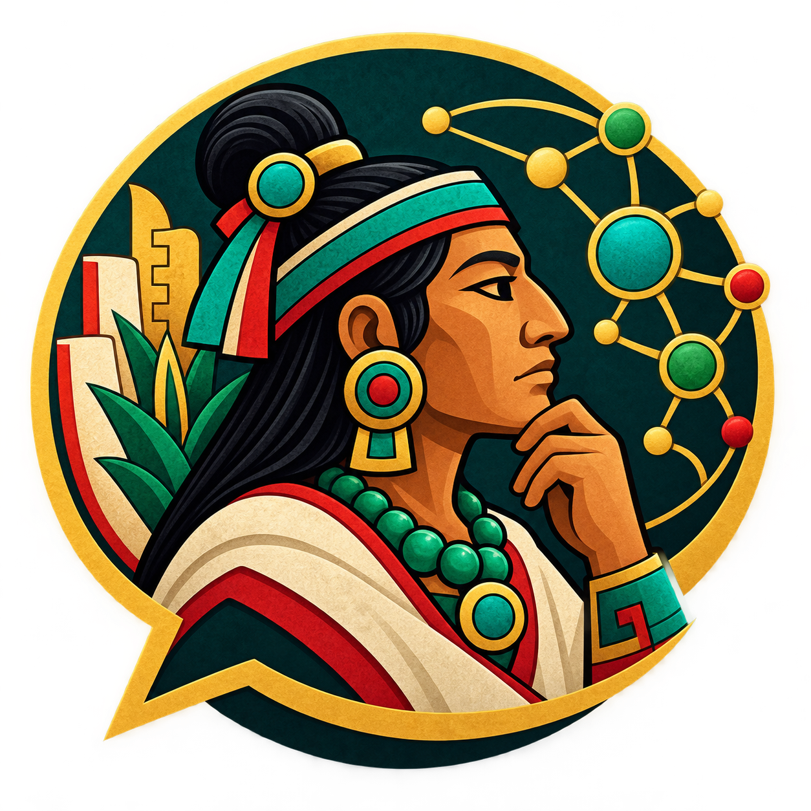
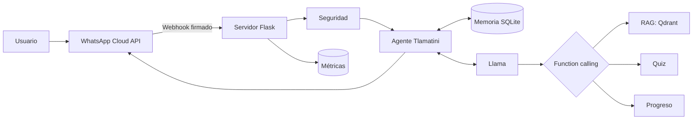
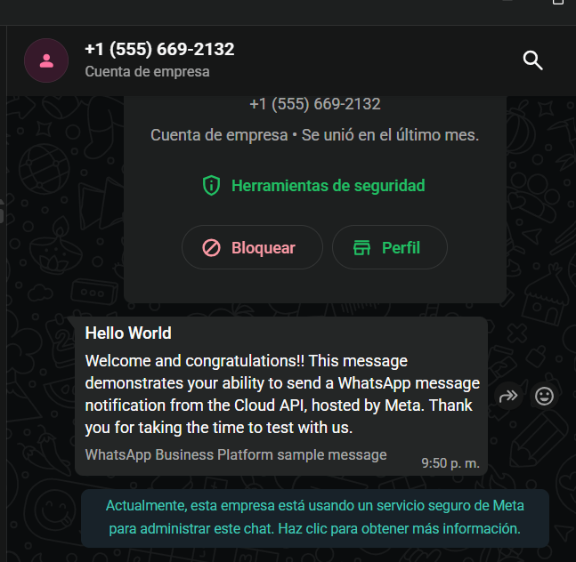
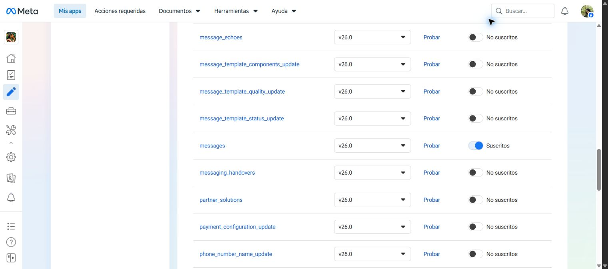

# Tlamatini WhatsApp

**Hackathon 2 — IA Aplicada con Modelos Abiertos, DEV.F**

<p align="center">
  
</p>

Tlamatini es un tutor conversacional de historia mexica conectado a WhatsApp. Usa Llama como motor de razonamiento, recupera evidencia desde una base documental, conserva memoria independiente por estudiante y ejecuta herramientas para iniciar cuestionarios y consultar progreso.

## Lo que demuestra

- Recepción y envío de mensajes con WhatsApp Cloud API.
- Llama 3.2 mediante Ollama, con adaptador opcional para Groq.
- Estado persistente por número telefónico.
- RAG semántico con Sentence Transformers y Qdrant.
- Function calling con herramientas permitidas y argumentos validados.
- Quiz educativo con almacenamiento de resultados.
- Detección de inyecciones de prompt y revisión de contenido.
- Firma del webhook, idempotencia, timeouts y fallback.
- Métricas de latencia, errores, mensajes y uso de herramientas.

## Arquitectura



El canal no decide la respuesta. WhatsApp entrega el mensaje al webhook; el servidor valida la petición, recupera el estado del usuario y consulta a Llama. Si Llama solicita una herramienta, el servidor valida y ejecuta la función, regresa el resultado al modelo y finalmente envía la respuesta natural al teléfono.

## Estructura

```text
.
├── data/
│   ├── historia_mexica.json   # Base documental
│   └── quiz_mexica.json       # Banco de preguntas
├── docs/
│   └── PRUEBAS_MANUALES.md
├── scripts/
│   └── simular_webhook.py
├── tests/                     # Pruebas automatizadas
├── tlamatini/
│   ├── agent.py               # Orquestación y ciclo de herramientas
│   ├── app.py                 # Webhook y endpoints Flask
│   ├── config.py              # Variables de entorno
│   ├── knowledge.py           # RAG semántico + respaldo léxico
│   ├── llm.py                 # Adaptadores Ollama/Groq
│   ├── security.py            # Firma, Prompt Guard y contenido
│   ├── store.py               # Memoria, idempotencia y métricas
│   ├── tools.py               # Herramientas del agente
│   └── whatsapp.py            # Cliente de WhatsApp Cloud API
├── .env.example
├── Dockerfile
├── requirements.txt
└── run.py
```

## Instalación local

Requiere Python 3.11 o superior y Ollama.

### Windows PowerShell

```powershell
python -m venv .venv
.\.venv\Scripts\Activate.ps1
python -m pip install -r requirements.txt
Copy-Item .env.example .env
ollama pull llama3.2:3b
python run.py
```

El servicio queda disponible en `http://127.0.0.1:5000`.

Comprueba su estado:

```powershell
Invoke-RestMethod http://127.0.0.1:5000/health
```

## Configuración

Los secretos nunca se escriben en el código. Copia `.env.example` como `.env` y completa las variables correspondientes.

| Variable | Propósito |
|---|---|
| `WHATSAPP_VERIFY_TOKEN` | Valor elegido por el equipo para verificar el webhook. |
| `WHATSAPP_ACCESS_TOKEN` | Token de acceso generado en Meta for Developers. |
| `WHATSAPP_PHONE_NUMBER_ID` | Identificador del número de prueba o producción. |
| `WHATSAPP_APP_SECRET` | Secreto de la aplicación para validar `X-Hub-Signature-256`. |
| `WHATSAPP_API_VERSION` | Versión configurable de Graph API; se deja fuera del código para poder actualizarla. |
| `WHATSAPP_DRY_RUN` | En `true`, registra la respuesta sin enviarla a Meta; debe cambiarse a `false` para la prueba real. |
| `LLM_PROVIDER` | `ollama` o `groq`. |
| `OLLAMA_MODEL` | Modelo local; el valor inicial es `llama3.2:3b`. |
| `GROQ_API_KEY` / `GROQ_MODEL` | Alternativa para un modelo Llama habilitado en Groq. |

## Herramientas expuestas a Llama

1. `buscar_informacion_historica(consulta, limite)` recupera fragmentos y fuentes.
2. `iniciar_quiz(tema, dificultad)` crea un turno de opción múltiple y guarda el estado pendiente.
3. `consultar_progreso()` obtiene aciertos y porcentaje del estudiante actual.

Llama únicamente solicita la ejecución. El servidor mantiene una lista cerrada, valida cada argumento y ejecuta el código real.

## Seguridad

- Verificación HMAC-SHA256 de eventos enviados por Meta.
- Detección local de patrones de inyección, con Prompt Guard de Groq opcional.
- Revisión local de contenido, con Llama Guard mediante Ollama opcional.
- Variables sensibles fuera del repositorio.
- Herramientas permitidas por lista cerrada.
- Control por ID para no procesar dos veces un webhook repetido.
- Límite de rondas de herramientas y timeouts en servicios externos.

El modo `rules` permite ejecutar la demostración sin un segundo modelo. Para la defensa más completa se puede configurar `PROMPT_GUARD_MODE=groq` o `CONTENT_GUARD_MODE=ollama` y descargar `llama-guard3:1b`.

## Monitoreo

- `GET /health`: estado de configuración del servicio.
- `GET /metrics`: total de mensajes, tasa de error, latencia promedio y herramientas ejecutadas.
- SQLite conserva eventos operativos y resultados de quizzes.

## Pruebas

```powershell
.\.venv\Scripts\python.exe -m pytest -q
```

Las pruebas cubren firma del webhook, verificación inicial, mensajes duplicados, reintentos después de error, memoria, herramientas, quiz e inyecciones de prompt.

Para probar todo el flujo local sin Meta:

```powershell
.\.venv\Scripts\python.exe scripts\simular_webhook.py
```

La copia inicial de `.env.example` deja `WHATSAPP_DRY_RUN=true` y usa un secreto local de demostración. La conexión real sustituye ese valor por el App Secret de Meta y cambia el modo a `false`.

Consulta [docs/PRUEBAS_MANUALES.md](docs/PRUEBAS_MANUALES.md) para el guion de demostración final.

## Evidencia de integración

El número de prueba de WhatsApp Cloud API envió correctamente la plantilla oficial al destinatario verificado:

<p align="center">
  
</p>

Durante la conexión final también se verificó el webhook mediante `hub.challenge`, se suscribió el campo `messages` y se mantuvo activa la validación HMAC-SHA256 con el App Secret de Meta.

<p align="center">
  
</p>

El panel de Meta confirmó además la entrega correcta de un evento de prueba `Incoming Message` al servidor. Las capturas se recortaron para no publicar tokens de acceso, secretos de aplicación ni teléfonos personales.

> **Nota sobre los tokens:** el token de acceso que genera el panel de prueba de Meta es temporal y puede volver a mostrarse como “Not generated yet” después de abandonar la página. No es el token de verificación del webhook ni significa que `.env` se haya borrado. Para producción debe utilizarse un token permanente de usuario del sistema y un gestor de secretos.

## Despliegue

Para la demostración se utilizó un túnel temporal de Cloudflare hacia el servidor local. Este mecanismo es adecuado para una prueba controlada, pero no se presenta como infraestructura productiva. El `Dockerfile` permite mover el agente a un servidor continuo. En producción deben agregarse un gestor de secretos, HTTPS, una cola de tareas, almacenamiento administrado y alertas sobre errores y latencia.

## Limitaciones declaradas

- La base documental incluida es intencionalmente pequeña y educativa.
- SQLite es adecuado para el prototipo; un despliegue con varias réplicas debe usar una base compartida.
- El procesamiento en segundo plano usa hilos durante la demostración; producción requiere una cola persistente.
- La URL de Cloudflare Quick Tunnel cambia o desaparece cuando termina el túnel.
